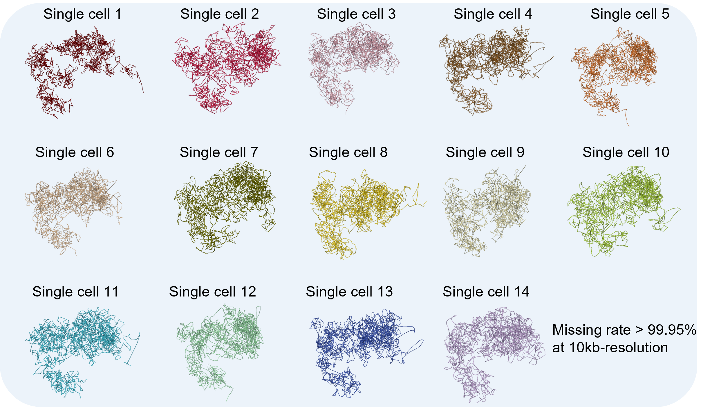

# tFLAMINGO: **t**ensor-based **F**ast **L**ow-r**A**nk **M**atrix completion algorithm for reconstruct**IN**g high-resolution 3D **G**enome **O**rganizations
## Gallery
**The 3D structures of chromosome 21 for 15 single cells in 10-kb resolution** based on Dip-C data (GM12878).


## Summary
tFLAMINGO aims to accurately reconstruct the 3D chromatin structures for each single cell from super sparse scHi-C contact maps (missing rate > 99.95%). Remarkablely, the tensor-completion-based method borrows information across single cells, while preserving the unique 3D chromatin structures of each single cell.

## Introduction
tFLAMINGO takes scHi-C data for tens to hundreds of single cells as inputs and reconstruct the 3D chromatin structure for each single cell. tFLAMINGO has two major steps. In the first step, the contact maps of all single cells are modeled as a sparse tensor and then complted using the low-rank tensor completion method. This step gives a much denser contact maps (missing rate 90%-95%) for each single cell. In the second step, the 3D genome structures are reconstructed for each single cell from the completed contact map using [FLAMINGO](https://github.com/wangjr03/FLAMINGO/).

## Dependencies
The implementation of the algorithm is based on python/3.8 and R/3.5.1. It depends on three R packages (Matrix, FLAMINGOr and GenomicFeatures) and seven python libraries (pyfftw, scipy, numpy, pandas, math, joblib and ray).

## Installation of the tFLAMINGOr package
The code for the first step is available in the Github: <br>
```
git clone https://github.com/wangjr03/tFLAMINGO.git
cd tFLAMINGO/src
ls
```
The R package for tFLAMINGO (*tFLAMINGOr*) can be installed through Github using *devtools*:<br>
```
install.packages("devtools")
library(devtools)
install_github('wangjr03/tFLAMINGO/tFLAMINGOr')
```
## Input data
The standard sparse-matrix format scHi-C data is accepted
```
chr1 12345 chr1 13456
```
## Reconstruct the 3D genome structure with tFLAMINGOr
The main function of tFLAMINGO can be utilized as follow:<br>
```
# generate contact maps from the raw data
library(tFLAMINGOr)

```
